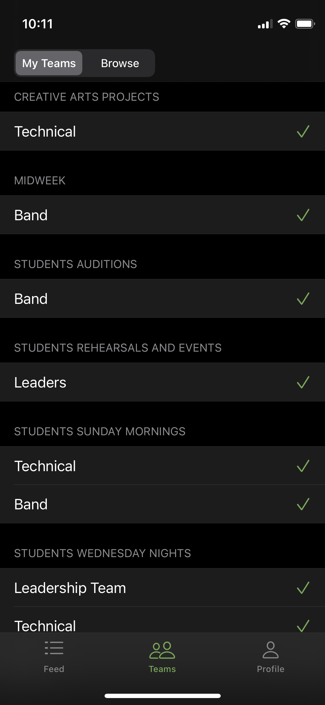
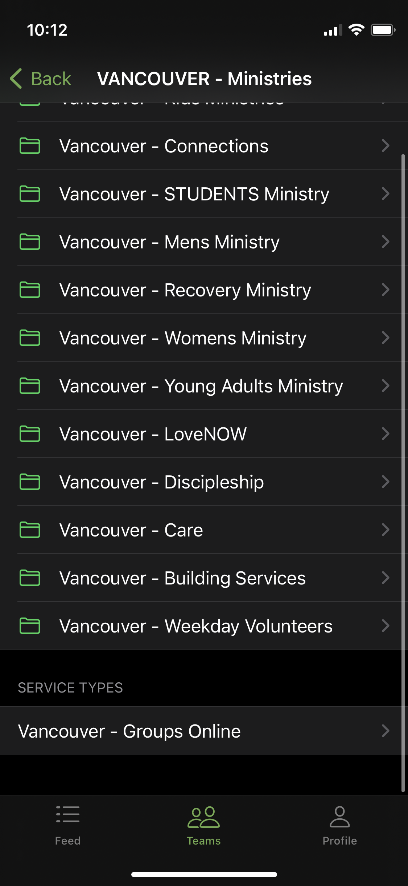
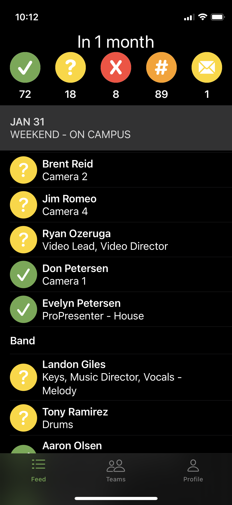
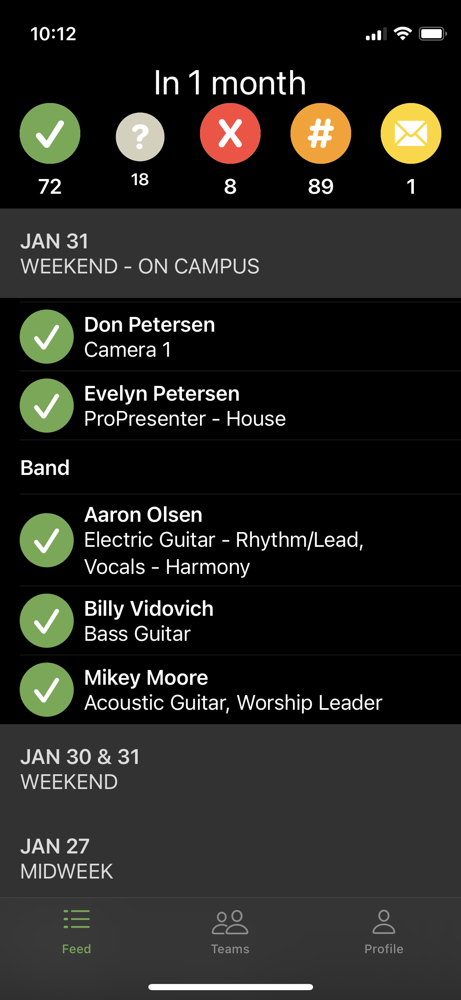

# Services Scheduler

An iOS app to make scheduling volunteers for Planning Center Services easier.

It features a networking and caching layer that focuses on composability and functions over protocols.

## Screenshots
### My Teams
My Teams screen showing the teams the user belongs to and allows selecting which teams to use for the Feed.

### Teams Browser
Browser screen of the app showing folders and single items

### Feed
Feed screen of the app showing upcoming positions and who is filling them as well as controls to filter the list

Feed screen of the app in a filtered state

